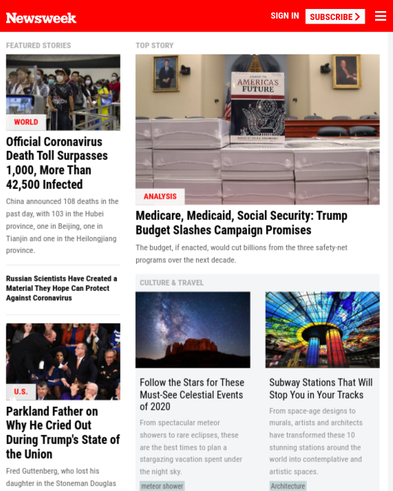

# NewsWeek Clone

> This is a clone of The News Week website, which I have managed to duplicate on my own using pure HTML and CSS and bootstrap, and I have named it NewsWeek-Clone.

### Desktop version:

### Tablet version:

### Mobile version:

## Built With

- HTML, CSS,
- Bootsrap,
- mediaQueries.

## Live Demo

[Live Demo Link](https://raw.githack.com/elmejdki/NewsWeekClone/create-news-page/index.html)

## Getting Started

To get a local copy up and running follow these simple example steps.

### Prerequisites

To make this repository working in your local machine you need only a browser.

## Authors

👤 **Zakariae El Mejdki**

- Github: [@elmejdki](https://github.com/elmejdki)
- Twitter: [@ZakariaeElMEjdki](https://twitter.com/0ca7848f87ab470)
- Linkedin: [Zakariae El Mejdki](https://www.linkedin.com/in/zakariae-el-mejdki-644898139/)

## 🤝 Contributing

Contributions, issues and feature requests are welcome!

Feel free to check the [issues page](https://github.com/elmejdki/TNW-clone/issues).

## Show your support

Give a ⭐️ if you like this project!

## Acknowledgments

a big hat to me and my partner Brenda and anyone who help us either by openning issues on this repository or reviewing our code :)

## 📝 License

This project is [MIT](lic.url) licensed.
